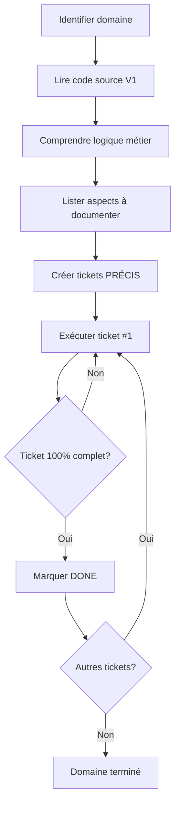

# Approche Progressive pour l'Audit Warhammer V1

**Date** : 2025-11-07
**Philosophie** : Analyser d'abord, créer tickets ensuite, éviter les placeholders génériques

---

## Pourquoi cette approche ?

### Échec de l'approche "335 tickets générés d'avance"

Tentative initiale : générer 335 tickets automatiquement basé sur une estimation.

**Résultat** :
- Tickets #001-#085 (tables) : ✅ Corrects (structure claire et connue)
- Tickets #086-#335 (features) : ❌ Génériques et sans valeur
  - "Infrastructure Gas Feature 11" - absurde
  - "Business Rules Feature 12" - sans contexte
  - "Fichiers à analyser: Multiple" - inutile

**Leçon** : On ne peut PAS créer des tickets de qualité sans avoir analysé le code source.

### Nouveau principe

> **"Pas de ticket avant d'avoir compris"**

1. ✅ Analyser le code V1 en profondeur
2. ✅ Comprendre la logique métier
3. ✅ Créer des tickets PRÉCIS avec contexte
4. ✅ Exécuter les tickets pour créer la KB
5. ✅ Répéter

---

## Phase 1 : Tables de Données (ACTUELLE)

### Statut : 85 tickets créés ✅

Les tickets #001-#085 couvrent **toutes les tables de données** car leur structure est claire et documentée dans les fichiers JSON.

#### Répartition

**Tables TRÈS COMPLEXES** (48 tickets):
- Species (7) - #001-#007
- Careers (8) - #008-#015
- CareerLevels (8) - #016-#023
- Talents (9) - #024-#032
- Spells (5) - #033-#037
- Skills (5) - #038-#042
- Trappings (6) - #043-#048

**Tables MOYENNES** (32 tickets):
- Lores, Creatures, Trees, Gods, Traits, Stars, Magicks, Details, Qualities, Etats, Characteristics, Psychologies

**Tables SIMPLES** (5 tickets):
- Books, Classes, Eyes/Hairs

#### Prochaine étape

**Exécuter le ticket #001** : Species Schema & Relations

---

## Phase 2 : Wizard Création (FUTURE)

### Statut : Tickets À CRÉER après analyse

**Approche** :
1. Lire et analyser TOUS les fichiers wizard V1 :
   - `warhammer-v1/src/StepSpecies.html`
   - `warhammer-v1/src/StepCareers.html`
   - `warhammer-v1/src/StepCharacteristics.html`
   - etc. (10 steps)

2. Pour CHAQUE step, identifier :
   - Objectif utilisateur
   - Flux fonctionnel
   - Règles métier
   - Dépendances vers tables
   - Cas particuliers et edge cases

3. Créer tickets PRÉCIS :
   - Titre descriptif (pas "Wizard Step 1 Feature 3")
   - Périmètre clair
   - Fichiers source identifiés
   - Critères d'acceptance vérifiables

4. Estimation : **40-60 tickets** (après analyse)

---

## Phase 3 : Modèle Character (FUTURE)

### Statut : Tickets À CRÉER après analyse

**Fichier critique** : `warhammer-v1/src/Character.html` (925 lignes)

**Approche** :
1. Lire le fichier complet
2. Identifier toutes les méthodes et leur rôle métier
3. Documenter la structure de données
4. Comprendre les calculs dérivés
5. Créer tickets PRÉCIS

**Estimation** : **10-15 tickets** (après analyse)

---

## Phase 4-N : Autres Systèmes (FUTURE)

### Domaines à analyser progressivement

1. **Avancement XP** (~10-15 tickets)
2. **Système Magie** (~8-12 tickets)
3. **Équipement/Inventaire** (~8-12 tickets)
4. **Import/Export Foundry** (~8-12 tickets)
5. **Recherche/Navigation** (~10-15 tickets)
6. **Administration** (~8-12 tickets)
7. **Règles Métier transverses** (~20-30 tickets)
8. **Infrastructure GAS** (~8-12 tickets)
9. **Utilitaires** (~15-20 tickets)

**Pour chaque domaine** :
- Analyser le code V1
- Créer tickets précis
- Exécuter et créer KB
- Passer au suivant

---

## Estimation Finale Révisée

### Avant (approche naïve)
- **335 tickets** générés automatiquement
- 250 tickets génériques sans valeur
- Perte de temps et confusion

### Après (approche progressive)
- **85 tickets** tables (validés ✅)
- **~120-165 tickets** autres domaines (à créer progressivement)
- **TOTAL : 205-250 tickets** (estimation)

### Durée estimée

**Phase 1 (Tables)** : 2-3 semaines (1 dev) ou 1 semaine (3 devs)

**Phases suivantes** : À estimer après analyse de chaque domaine

---

## Méthodologie de Création de Tickets

### ❌ MAUVAIS EXEMPLE (approche automatique)

```markdown
---
id: 316
title: Business Rules Feature 12
---

## Fichiers à analyser
- Multiple
```

**Problème** : Aucun contexte, aucune valeur

### ✅ BON EXEMPLE (après analyse)

```markdown
---
id: 086
title: Wizard Step Species - Sélection Espèce et Région
dependencies: [001, 002, 003]
---

## Objectif
Documenter le flux de sélection d'espèce dans le wizard de création de personnage.

## Périmètre
**DANS le scope:**
- Sélection espèce/sous-espèce
- Sélection région (pour Humains)
- Génération aléatoire pondérée
- Application caractéristiques de base
- Affichage détails espèce

## Fichiers à analyser
- warhammer-v1/src/StepSpecies.html (lignes 1-350)
- warhammer-v1/src/data/species.json

## Livrables
audit/features/character-creation/step-species-selection.md
```

**Qualité** : Contexte clair, fichiers précis, périmètre défini

---

## Principes de Qualité

### 1. Pas de Placeholders Génériques

❌ "Feature 12"
❌ "Logique 3"
❌ "Aspect 7"

✅ "Sélection espèce et région"
✅ "Calcul coûts XP progression"
✅ "Export format Foundry VTT"

### 2. Analyser AVANT de Créer

1. Lire le code source
2. Comprendre la logique
3. Identifier les règles métier
4. PUIS créer le ticket

### 3. Critères d'Acceptance Vérifiables

❌ "Documenter la fonctionnalité"
✅ "Fichier < 200 lignes avec 3 exemples concrets Warhammer"

❌ "Expliquer les règles"
✅ "Toutes les formules de calcul documentées avec cas de test"

### 4. Pas de "Future Work"

Un ticket marqué DONE doit être **100% complet**.

Si quelque chose manque : le ticket reste IN_PROGRESS.

---

## Workflow Recommandé

### Pour chaque nouveau domaine



### Checklist avant création ticket

- [ ] Code source lu et compris
- [ ] Règles métier identifiées
- [ ] Titre descriptif (pas générique)
- [ ] Périmètre IN/OUT clair
- [ ] Fichiers source listés (chemins précis)
- [ ] Critères d'acceptance mesurables
- [ ] Dépendances identifiées

---

## Avantages de cette Approche

### vs Génération Automatique 335 Tickets

| Critère | Auto (335) | Progressive |
|---------|------------|-------------|
| Qualité tickets | ⚠️ 25% bons | ✅ 100% bons |
| Temps perdu | ❌ Élevé | ✅ Minimal |
| Compréhension code | ❌ Superficielle | ✅ Profonde |
| Tickets utilisables | 85/335 (25%) | 100% |
| Maintenance | ❌ Difficile | ✅ Simple |
| KB finale | ⚠️ Incomplète | ✅ Exhaustive |

### Alignement avec Contraintes Projet

✅ **"Pas de Future Work"** : Tickets créés uniquement quand on sait les compléter à 100%

✅ **"Fichiers < 200 lignes"** : Périmètre bien défini après analyse

✅ **"Aucune info technique"** : Comprendre le QUOI avant d'écrire

✅ **"Éviter saturation contexte"** : Tickets atomiques et ciblés

---

## Prochaines Étapes Immédiates

### 1. Exécuter Phase 1 (Tables)

Commencer par ticket #001 : Species Schema & Relations

**Objectif** : Créer 85 fichiers KB dans `audit/database/`

**Durée** : 2-3 semaines (1 dev)

### 2. Analyser Wizard (Préparer Phase 2)

Pendant Phase 1, lire progressivement les fichiers wizard pour préparer les tickets Phase 2.

### 3. Itérer

Répéter le cycle : Analyser → Créer tickets → Exécuter → Valider

---

## Conclusion

**L'approche progressive est plus lente au départ, mais plus efficace au final.**

- Pas de temps perdu sur tickets génériques
- Meilleure compréhension du code V1
- KB de qualité supérieure
- Moins de ré-usinage
- Migration V1→V2 mieux préparée

**Philosophie** : "Slow is smooth, smooth is fast"
